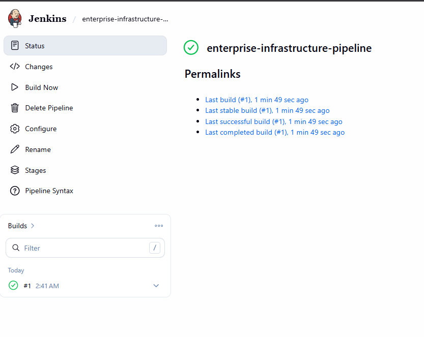

# Enterprise Infrastructure Automation Platform

> A production-inspired DevOps home lab demonstrating Infrastructure Automation, CI/CD, Configuration Management, and Containerized Application Deployment.

---

# Enterprise Infrastructure Automation Platform

This project demonstrates how modern infrastructure can be automated using industry-standard DevOps tools.

The environment consists of multiple Ubuntu virtual machines managed with **Ansible**, deployed through **Jenkins CI/CD**, version controlled with **GitHub**, and hosting containerized applications using **Docker**.

The goal of this project is to simulate an enterprise infrastructure environment while following professional software engineering practices such as:

- Feature Branch Workflow
- Pull Requests
- Jenkins CI/CD
- Infrastructure as Code
- Configuration Management
- Automated Deployments
- Documentation
- Architecture Diagrams

---

# Architecture


---

# Technology Stack

| Category | Technology |
|-----------|------------|
| Operating System | Ubuntu 24.04 LTS |
| Source Control | Git / GitHub |
| CI/CD | Jenkins |
| Automation | Ansible |
| Containers | Docker |
| Web Server | Nginx |
| Database | PostgreSQL 14 |
| Database | IBM Db2 (Lab) |
| Virtualization | Oracle VirtualBox |

---

# Infrastructure

| Server | IP Address | Purpose |
|----------|------------|----------------------------|
| ubuntu-lab2 | 192.168.40.9 | Ansible Controller |
| app-lab2 | 192.168.40.10 | Docker + Nginx |
| pg-standby2 | 192.168.40.11 | PostgreSQL |
| db2-lab2 | 192.168.40.12 | IBM Db2 |
| jenkins-lab2 | 192.168.40.13 | Jenkins CI/CD |

---

# Repository Structure

```
enterprise-infrastructure-automation
│
├── docs/
│   ├── architecture.drawio
│   ├── architecture.png
│   └── screenshots/
│
├── inventory/
│
├── playbooks/
│
├── roles/
│   ├── common/
│   ├── docker/
│   ├── nginx/
│   ├── postgresql/
│   └── jenkins/
│
├── files/
│
├── templates/
│
├── ansible.cfg
├── Jenkinsfile
└── README.md
```

---

# CI/CD Pipeline

The Jenkins deployment pipeline performs the following stages:

1. Checkout Source Code
2. Verify Controller Connectivity
3. Synchronize Deployment Repository
4. Ansible Syntax Validation
5. Deploy Nginx Container
6. Verify Running Container
7. Application Health Check

Every deployment is validated automatically before completion.

---

# Deployment Workflow

```
Developer

↓

Git Push

↓

Feature Branch

↓

Pull Request

↓

Jenkins Pipeline

↓

SSH

↓

Ansible Controller

↓

Docker Deployment

↓

Health Check

↓

Merge to Main
```

---

# Screenshots

## Jenkins Pipeline



---

# Current Features

- Multi-VM Infrastructure
- GitHub Feature Branch Workflow
- Pull Requests
- Jenkins CI/CD
- Automated Deployments
- Dockerized Nginx
- PostgreSQL Automation
- Db2 Lab Environment
- Infrastructure Documentation
- Architecture Diagram

---

# Roadmap

## Version 2

- Prometheus
- Grafana
- Node Exporter
- PostgreSQL Monitoring

---

## Version 3

- Kubernetes (k3s)
- Helm
- MetalLB
- Ingress

---

## Version 4

- Terraform
- AWS
- Azure
- Google Cloud

---

## Version 5

- GitOps
- ArgoCD
- Automated Rollback
- Kubernetes Deployments

---

# Lessons Learned

Throughout this project I gained practical experience with:

- Linux Administration
- SSH Troubleshooting
- Git Branching Strategy
- Pull Request Workflow
- Jenkins Pipeline Development
- Ansible Roles
- Docker Automation
- Infrastructure Documentation
- CI/CD Best Practices

---

# Author

**Kossi Hevi-Doglan**

DevOps Engineer | Infrastructure Automation | Cloud | CI/CD | Linux | Oracle | PostgreSQL

GitHub:
https://github.com/khevi

---

# License

This project is intended for educational and portfolio purposes.
