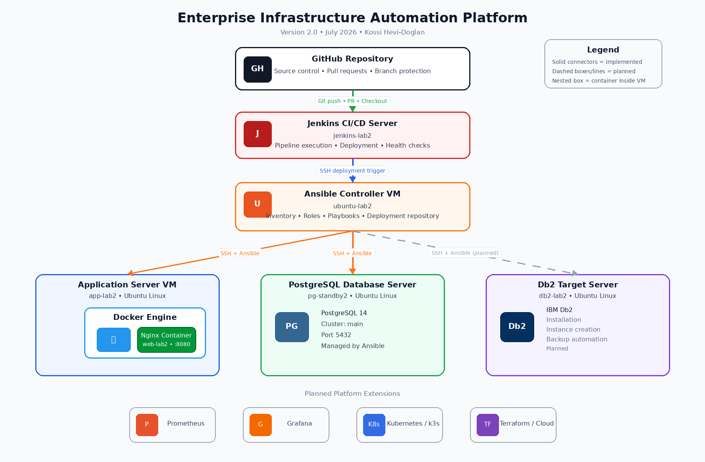
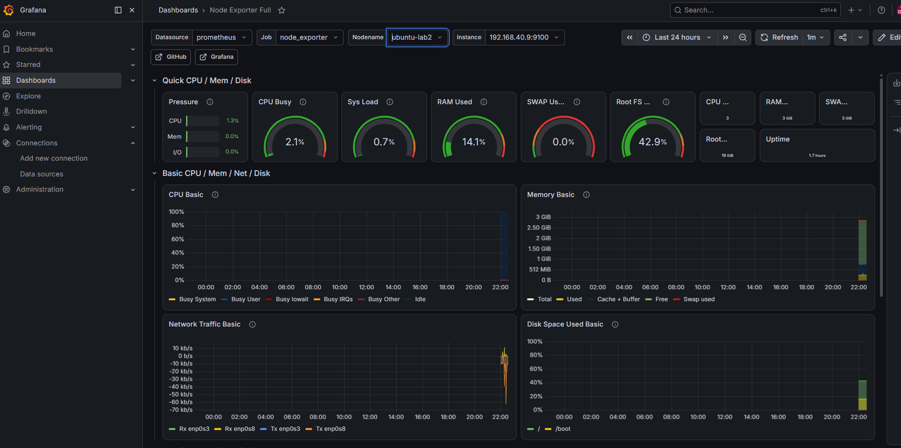

# Enterprise Infrastructure Automation

> An enterprise-style DevOps project demonstrating Infrastructure as Code (IaC), Configuration Management, Containerization, Database Automation, and Continuous Integration using Ansible, Docker, PostgreSQL, Jenkins, and Linux.

---

## Overview

Enterprise Infrastructure Automation is a hands-on DevOps project built to simulate a production-style environment.

The project demonstrates how infrastructure can be provisioned, configured, and managed using Ansible while integrating Docker containers, PostgreSQL, and a dedicated Jenkins CI/CD server.

The long-term objective is to evolve this project into a complete enterprise DevOps platform by adding monitoring, Kubernetes, Terraform, and cloud deployments.

---

# Current Architecture

```text
                             GitHub
                                │
                                │ (Source Control)
                                │
                                ▼
                     +-----------------------+
                     |    Jenkins Server     |
                     |     jenkins-lab2      |
                     |     CI/CD Pipeline    |
                     +-----------+-----------+
                                 │
                                 │ (Planned CI/CD Integration)
                                 ▼
                     +-----------------------+
                     |   Ansible Controller  |
                     |     ubuntu-lab2       |
                     +-----------+-----------+
                                 │
      --------------------------------------------------------------
      │                         │                        │
      │                         │                        │
      ▼                         ▼                        ▼
+----------------+      +----------------+      +----------------+
| app-lab2       |      | pg-standby2    |      | db2-lab2       |
|----------------|      |----------------|      |----------------|
| Docker         |      | PostgreSQL 14  |      | IBM Db2        |
| Nginx          |      | Database       |      | Planned        |
+----------------+      +----------------+      +----------------+
```

---

# Environment

| Server | Purpose |
|---------|---------|
| ubuntu-lab2 | Ansible Control Node |
| app-lab2 | Docker & Nginx Application Server |
| pg-standby2 | PostgreSQL Database Server |
| db2-lab2 | IBM Db2 Target Server *(planned automation)* |
| jenkins-lab2 | Jenkins CI/CD Server |

---

# Technologies

## Operating System

- Ubuntu Server 22.04 LTS

## Automation

- Ansible

## Containers

- Docker
- Nginx

## Databases

- PostgreSQL 14
- IBM Db2 *(planned)*

## CI/CD

- Jenkins LTS

## Version Control

- Git
- GitHub

## Connectivity

- SSH Key Authentication

---

# Repository Structure

```text
enterprise-infrastructure-automation/
│
├── ansible.cfg
├── README.md
├── requirements.yml
│
├── inventory/
│   ├── hosts.example
│   └── hosts
│
├── playbooks/
│   ├── baseline.yml
│   ├── docker.yml
│   ├── nginx-container.yml
│   ├── postgresql.yml
│   └── jenkins.yml
│
├── roles/
│   ├── common/
│   ├── docker/
│   ├── nginx/
│   ├── postgresql/
│   └── jenkins/
│
├── files/
├── templates/
├── group_vars/
├── host_vars/
└── docs/
```

---

# Prerequisites

Before using this project, ensure you have:

- Ubuntu Linux
- Python 3
- Ansible
- SSH key authentication configured
- A user with sudo privileges
- VirtualBox, VMware, or another virtualization platform

Install the required Ansible collections:

```bash
ansible-galaxy collection install -r requirements.yml
```

---

# Quick Start

Clone the repository

```bash
git clone https://github.com/khevi/enterprise-infrastructure-automation.git
cd enterprise-infrastructure-automation
```

Copy the inventory

```bash
cp inventory/hosts.example inventory/hosts
```

Update your inventory with your server information.

Verify connectivity

```bash
ansible linux -m ping
```

Deploy the baseline configuration

```bash
ansible-playbook playbooks/baseline.yml --ask-become-pass
```

Deploy Docker

```bash
ansible-playbook playbooks/docker.yml --ask-become-pass
```

Deploy Nginx

```bash
ansible-playbook playbooks/nginx-container.yml --ask-become-pass
```

Deploy PostgreSQL

```bash
ansible-playbook playbooks/postgresql.yml --ask-become-pass
```

Deploy Jenkins

```bash
ansible-playbook playbooks/jenkins.yml --ask-become-pass
```

---

# Current Features

- SSH key-based authentication
- Centralized Ansible inventory
- Role-based Ansible project structure
- Baseline Linux configuration
- Docker installation and configuration
- Docker Python SDK installation
- Automated Nginx deployment
- Custom web content deployment
- PostgreSQL installation and configuration
- Dedicated Jenkins server deployment
- Idempotent Ansible playbooks

---

# Skills Demonstrated

- Infrastructure as Code (IaC)
- Linux System Administration
- Configuration Management
- Docker Containerization
- PostgreSQL Administration
- Jenkins CI/CD
- SSH Authentication
- Git Version Control
- GitHub Collaboration
- Enterprise Infrastructure Automation

---

# Roadmap

## Completed

- [x] Ubuntu Infrastructure
- [x] SSH Key Authentication
- [x] Ansible Inventory
- [x] Role-Based Automation
- [x] Docker Installation
- [x] Nginx Container Deployment
- [x] PostgreSQL Deployment
- [x] Jenkins Server Deployment

## In Progress

- [ ] Jenkins Pipeline
- [ ] GitHub Webhooks
- [ ] Automated CI/CD Deployment

## Planned

- [ ] IBM Db2 Automation
- [ ] Prometheus Monitoring
- [ ] Grafana Dashboards
- [ ] Kubernetes (k3s)
- [ ] Helm
- [ ] Terraform
- [ ] AWS Deployment
- [ ] Azure Deployment
- [ ] Google Cloud Deployment

---

# Lessons Learned

During this project I encountered and resolved several real-world engineering challenges, including:

- Docker Python SDK integration with Ansible
- SSH connectivity and authentication troubleshooting
- Git SSH connection stability
- Designing idempotent Ansible playbooks
- Structuring reusable Ansible roles
- Building a dedicated CI/CD server instead of combining services

---

# Future Enhancements

This project will continue evolving into a complete enterprise DevOps platform featuring:

- Automated CI/CD pipelines
- Infrastructure monitoring
- Container orchestration
- Infrastructure provisioning
- Multi-cloud deployments
- Production-style automation

## CI/CD Pipeline

The Jenkins validation pipeline connects the GitHub repository, Jenkins server, Ansible controller, and managed infrastructure.

Current pipeline stages:

- Checkout source code
- Verify SSH access to the Ansible controller
- Verify the Ansible installation
- Test managed-host connectivity
- Validate the Nginx playbook syntax
- Verify the deployed application health

## Enterprise Architecture

The diagram below illustrates the overall architecture of the Enterprise Infrastructure Automation Platform.



---

## Monitoring Dashboard

The platform is monitored using Prometheus and Grafana. The dashboard below displays real-time CPU, memory, disk, network, and system health metrics collected from all managed servers.




---

# Author

**Kossi Hevi-Doglan**

DevOps Engineer | Cloud Engineer | Infrastructure Automation

GitHub: https://github.com/khevi
